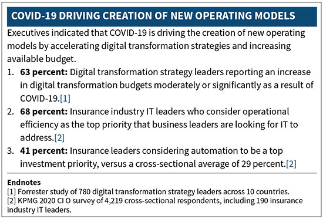

# Actuarial Process Optimization—A Case for Using Modern Technology in Actuarial Domain

---

---

## Contents

* [Overview](Actuarial%20Process%20Optimization%20-%20A%20Case%20for%20Using%20Modern%20Technology%20in%20the%20Actuarial%20Domain.md#overview)
  - [Defining Actuarial Process Optimization](Actuarial%20Process%20Optimization%20-%20A%20Case%20for%20Using%20Modern%20Technology%20in%20the%20Actuarial%20Domain.md#defining-actuarial-process-optimization)
  - [Opportunities for APO](Actuarial%20Process%20Optimization%20-%20A%20Case%20for%20Using%20Modern%20Technology%20in%20the%20Actuarial%20Domain.md#opportunities-for-apo)
  - [APO in Action](Actuarial%20Process%20Optimization%20-%20A%20Case%20for%20Using%20Modern%20Technology%20in%20the%20Actuarial%20Domain.md#apo-in-action)
  - [Providing Strategic Business Direction](Actuarial%20Process%20Optimization%20-%20A%20Case%20for%20Using%20Modern%20Technology%20in%20the%20Actuarial%20Domain.md#apo-in-action-providing-strategic-business-direction)
  - [Maintaining Governance, Controls, and Risk Frameworks](Actuarial%20Process%20Optimization%20-%20A%20Case%20for%20Using%20Modern%20Technology%20in%20the%20Actuarial%20Domain.md#apo-in-action-maintaining-governance-controls-and-risk-frameworks)
  - [Optimizing Skillsets and Technologies](Actuarial%20Process%20Optimization%20-%20A%20Case%20for%20Using%20Modern%20Technology%20in%20the%20Actuarial%20Domain.md#apo-in-action-optimizing-skillsets-and-technologies)
  - [In Conclusion](Actuarial%20Process%20Optimization%20-%20A%20Case%20for%20Using%20Modern%20Technology%20in%20the%20Actuarial%20Domain.md#in-conclusion)

## Overview

Innovation in technology has disrupted nearly every industry creating mounting internal and external pressures on organizations to accelerate the adoption of their digital agendas. The COVID-19 pandemic further brought to light the need for technology to be adaptable, powerful, and scalable. Insurance companies have been trying to keep up with the pace of innovation, primarily focusing on adopting modern technology on the consumer experience front. Many have modernized the front office processes that support application, underwriting, and claim handling. The significant benefits achieved through process optimization and the use of modern technology have been the topic of discussions at many insurance conferences and publications.

As technology leaders are looking to expand insurers digital agenda to the middle and back offices, it is important to focus on how new technology can support actuaries in their daily work today and in the future. It is imperative that leadership consider the role of the future actuary as its responsibilities grow and evolve. In addition to what is considered traditional actuarial work today, the actuary of the future is expected to provide leadership with strategic business direction, own governance, controls and risk frameworks, and focus on optimization of skillsets and technology within their domain.

As the insurance industry leaps into the future, actuaries must not only proactively refine their roles and responsibilities within insurance companies, but also seek opportunities for improvements and optimization in their day-to-day work. This article will focus on how technology and actuarial process optimization will support the role of the future actuary as a leader, risk manager, and technologist.

#### Defining Actuarial Process Optimization

Since actuarial process optimization could mean various things to each of us, it is important to define the term for the purpose of this article. Actuarial process optimization is a framework for making continuous improvements, through the use of modern technology, to processes that commonly fall within actuarial responsibilities. We will focus our discussion on the use of modern technology including low-code/no-code technology, robotic process automation (RPA) tools, process orchestration applications, and analytics and visualization software. The advantages of implementing modern technology are increasingly attractive and cost effective. Insurers often realize return on upfront implementation costs within a year as a result of resource and time savings. Actuaries at these insurers shifted their time from carrying out repetitive and manual processes to higher value tasks, including conducting complex analyses that supports strategic decision making.

#### Opportunities for APO

Actuaries are valuable and strategically important resources to insurance companies. We are trained both on the job and through an intensive education and exam curriculum to study and own insurance risk. As highly capable professionals, actuaries are often self-reliant, and are interested in owning all technology tools, data and processes that support their daily jobs. However, this hands-on approach can lead to performing many tasks that do not require actuarial expertise. By occupying ourselves with various high effort but low value tasks, we often neglect to focus on higher value tasks that are truly valuable to the future of our organization. Advancements in technology and the desire for lean operations have contributed to many insurers evaluating their strategic direction and the role of the actuary of the future, shifting their focus onto highest value tasks. Consider below some common low-value, high-effort tasks that actuaries may encounter:

1. Unnecessarily complex and error prone ETL, production and reporting workflows.
1. Time and resources wasted on resolving errors and tracing back complex process steps.
1. Production and process errors that can result in misstatements and delays in reporting.
1. Multiple un-validated spreadsheets with overlapping functionalities.
1. Multiple sources of information, but no single “source of truth.”
1. Storage and processing time wastage.

While there has been much discussion, in person and in print, focused on the role of the actuary of the future, the general consensus states that the actuary of the future must be ready to provide strategic business direction, handle governance and risk frameworks, and optimize skillsets and technologies. The actuarial process optimization framework defines three pillars of technological opportunity to support the actuary of the future in being successful at his or her role:

1. Optimization and upscaling of existing technologies—target “band-aid” fixes, manual legacy processes, and processes that commonly fail or produce inconsistent output.
1. Process automation—target manual and frequently repetitive processes, and processes that could require scalability.
1. Taking advantage of new technologies—target opportunities for new insights, deeper analytical capabilities, new governance and control framework capabilities, and acceleration of complex multi-step processes.

#### APO in Action

The actuarial process optimization framework addresses the pillars of technological opportunity by tackling the highest effort, lowest value processes first to prove the concept within the organization and support the business case for a broader actuarial process optimization program. As companies realize returns on investments and enable actuaries to focus on higher value tasks, they construct a sustainable technological infrastructure for the actuary of the future. The examples below showcase how addressing the pillars of technological opportunity can enable the actuary of the future be successful at his or her role.

##### Providing Strategic Business Direction

Data has always been part of the actuarial realm. Now, more than ever, companies are relying on data to make strategic business decisions. Effective data management, data analysis, and predictive analytics provide opportunities to aid in the actuary’s role in guiding decision making. Insurance companies have been exploring big data, both structured and unstructured, to gain additional insights into their business and industry trends. As stewards and users of data, actuaries are also adept at finding the meaning in data, seeing trends, and generating insights. Enhanced reporting, analytics, and visualization will allow better understanding of your data and improve communication of findings.

Companies that elected to modernize their technology have been able to benefit from a greater level of customization than those choosing to utilize vendor-provided tools. They realized significant opportunities for scalability and wider use of data analysis, consolidation, and visualization routines across business units as a result of the modular structure of these routines. Along with development of reporting solutions and use of modern technologies, companies upskilled their actuaries, positioning them to explore and accelerate additional opportunities for actuarial process optimization within the organization. The return on investment was often realized within a year on the resources dedicated to implementation of these tools.

Consider changes brought about by US GAAP Long-Duration Targeted Improvements and IFRS17 accounting regulations. Both regulations require additional insights and transparency into the underlying company business. Disclosures must provide additional detail on financial results through attribution analysis and trends over multiple reporting periods. Many companies saw these regulatory reporting needs as catalyst to enhance the breadth and depth of their management reporting and take advantage of modern technology through actuarial process optimization. Insurers have combined low-code/no-code and data mining tools with dashboarding through visualization software to further explain movement of financial results. These tools allow for significant flexibility in aggregating and displaying results, with dynamic drill-down functionality and ability to conduct what-if analysis in real time. Modern technology solutions have replaced manual, error-prone consolidation and reporting processes often driven by spreadsheets with significant underlying key-person risks.

##### Maintaining Governance, Controls, and Risk Frameworks

For actuaries to effectively own and manage the risk frameworks within their organizations, they must rely on strong governance structures driven by a robust control framework and risk reporting. While complexity and level of effort of actuarial control testing and risk reporting may vary, these are generally periodic or event driven tasks that are repetitive by nature across various processes, data sets and time periods. Nevertheless, these tasks must be completed in order to satisfy regulatory, auditor or other internal requirements and maintain the integrity of the risk framework within the organization.

The repetitive nature of control testing processes makes them prime candidates for actuarial process optimization. Some insurance companies have introduced robotics process automation to allow for actuarial control testing processes be carried out in a more accurate, efficient, consistent, and scalable manner. These automated control testing routines can be initiated on a period or event-driven basis, and can run behind the scenes, on the server or cloud environment, and produce a detailed outcome report upon completion. In addition to significant time saving and freeing up valuable resources to carry out higher value tasks, automation of control testing allowed companies to expand the scope of testing to the entire population of data, rather than taking the traditional sampling approach carried out by a human. Another benefit reported by companies is that automation routines can carry out very complex calculations and reconciliations in a consistent and systematic manner, and practically eliminates human error risk in the process.

Common use cases for actuarial control testing automation include data quality testing and validation of large data sets. Consider a large insurance company that routinely uses dozens of assumption sets across functional areas and insurance products. Each set may contain hundreds of tables and adjustment factors. One of the most common areas for model errors identified through model validation exercises, is the use of inappropriate assumption in actuarial calculations. This could result from mislabeling of the table, use of an inappropriate assumption set, error in application of an adjustment factor or simply a human error such as a typo in value. A rule-based automated validation routine that systematically scans assumption tables, for both data quality and logical relationships amongst table values, can increase the level of confidence in actuarial model results. Rule-based validation allows for validation of each value in an assumption set, something that would be extremely difficult to execute manually. Rules can range from simple data quality validation rules, like “all table values must be between 0 and 1,” to more complex rules validating relationships across select and ultimate rates within a table or between a smoker and non-smoker table.

Automating actuarial control testing is not the only way modern technology can support risk frameworks within insurance companies. Process orchestration tools can act as a project manager, ferrying a task from person to person while automating certain process steps and reporting process analytics behind the scenes. Through actuarial process optimization, companies can consolidate multiple sub-processes into one software solution, which increases oversight, improves governance and allows for application supported validation.

##### Optimizing Skillsets and Technologies

One of the key responsibilities of the actuary of the future will be to ensure their team members are focused on challenging and rewarding tasks that add strategic value to the organization. Our profession requires a significant level of education and training in order to meet certification requirements as well as on a continuous ongoing basis, which allow us to gain valuable expertise focused on risk management, financial, and operational aspects of insurance. However, many actuaries spend their time performing routine manual tasks, working with dozens of spreadsheets and large data sets, and moving data between various systems. The actuary of the future will have to prioritize higher value tasks and identify opportunities to delegate or automate the rest.

Consider technology limitations from the past and how technological evolution has changed the required actuarial skillsets. Less than a decade ago, server computing capabilities would limit the way we worked—we had to aggregate our data into grouped model points, actuarial models had to be simpler and sometimes we had to wait for results overnight for model results to be produced. Technological progress, particularly cloud computing, has alleviated many of those hurdles, allowing for scalable computing and on-demand server capacities. Actuaries had to get comfortable with using cloud functionality and tools to take full advantage of the benefits they provide.

Optimizing the use of technology is also bringing higher efficiency to our work. Actuarial data management is another area that could significantly benefit from actuarial process optimization. While many insurance companies have consolidated and centralized their data repositories and data lakes within their IT and Data Science functional areas, actuaries remain heavy data users. Actuarial modeling, experience studies, and product and assumption development are only a sample of areas where we use large amounts of data. Actuaries use the data in a very particular way that requires consolidation of multiple data sources and fit-for-purpose transformations. Automating data preparation and exception reporting can save days of data processing time and free up valuable resources to focus on higher value tasks.

#### In Conclusion

Insurance companies have a significant opportunity to optimize resources, enhance operations and upskill actuaries by implementing the actuarial process optimization framework and fully embedding modern technology into the actuarial environment. As valuable resources with deep knowledge in risk management, financial reporting and operational considerations, actuaries must focus on higher value tasks that create strategic value for our employers and get comfortable with delegating and automating the lower value tasks. The three pillars of technological opportunity—optimization and upscaling of existing technologies, process automation, and utilization of new technologies—will be key elements in supporting the role of the actuary of the future. Through actuarial process optimization, technology and process optimization will enable and support the actuaries of the future.

---

## Appendix: Links & References

* [Actuarial Science](../2-Areas/MOCs/Actuarial%20Science.md)
* *Actuarial Posts*
* [Actuarial Property Casualty Data Thoughts](Actuarial%20Property%20Casualty%20Data%20Thoughts.md)
* [Actuarial Development Master Resource List](../2-Areas/Lists/Actuarial%20Development%20Master%20Resource%20List.md)

---

* https://www.soa.org/sections/technology/technology-newsletter/2021/october/att-2021-10-zaidlin/
