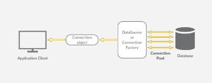

# Database Connection Pooling

*Source: [How to preserve database connection in a python web server](https://stackoverflow.com/questions/6688413/how-to-preserve-database-connection-in-a-python-web-server)*



A database connection pool maintains open a number of connections. The application layer simply takes a connection that is not being used, the connections get released when the application layer doesn't need them anymore. By "released" I mean that they get returned to the pool in order to be used again. 

## Anti-Patterns

Avoid the naive approach of creating and closing out a new database connection for each and every web request your client application/API sends to the server. Also, avoid the other side where a global session-wide, persistent connection is used across all endpoints as this approach can lead to issues with performance and scalability as well as the common pitfall of not closing out the connection when a user leaves then app or it times out. 

## Pooling

Database pooling is a nice middle ground between the two methods mentioned above on how to preserve a database connection properly. 

Instead of opening and closing a connection per request/endpoint, you now acquire and release a connection from the database connection pool. 

In Python you can utilize [PySQLPool](http://packages.python.org/PySQLPool/) for `mysql` for example.

For production applications with Python you should by using *SQLAlchemy* with a connection pool configured, even if you are not interested in coding using the native [SQLAlchemy ORM](SQLAlchemy%20ORM.md). See [SQLAlchemy in Flask — Flask Documentation (2.0.x)](https://flask.palletsprojects.com/en/2.0.x/patterns/sqlalchemy/#sql-abstraction-layer) for details on setting up a **SQL Abstraction Layer** with *SQLAlchemy* and *Flask*.

## Reference

* [Engine Configuration — SQLAlchemy 1.3 Documentation](https://docs.sqlalchemy.org/en/13/core/engines.html)
  * [Pooling -- SQLAlchemy 1.3 Documentation](https://docs.sqlalchemy.org/en/13/core/engines.html#pooling)
* [The Flask Mega-Tutorial Part IV Database](https://blog.miguelgrinberg.com/post/the-flask-mega-tutorial-part-iv-database)
* [Flask-SQLAlchemy — Flask-SQLAlchemy Documentation (2.x)](https://flask-sqlalchemy.palletsprojects.com/en/2.x/)
* [SQLAlchemy in Flask — Flask Documentation (2.0.x)](https://flask.palletsprojects.com/en/2.0.x/patterns/sqlalchemy/#sql-abstraction-layer)
* https://en.wikipedia.org/wiki/Singleton_pattern

---

Backlinks:

* *3-Resources/Tools/Python/Python Packages 1/Python Package - Flask*
* *3-Resources/Tools/Python/Python Packages 1/Python Package - SQLAlchemy*
* [System Design](System%20Design.md)
* [Web Development](../2-Areas/MOCs/Web%20Development.md)

*Backlinks:*

````dataview
list from [[Database Connection Pooling]] AND -"Changelog"
````
