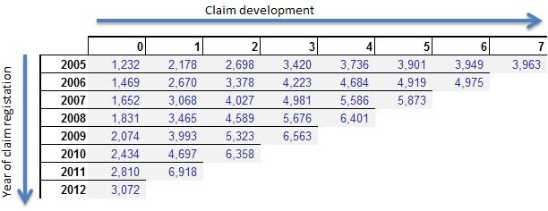

# Loss Triangles

*Source: [Loss Triangle |](http://www.hbactuarial.com/274-2/)*

\])

## Definition

A loss triangle is the primary method in which actuaries organize claims data that will be used in an actuarial analysis. 

The reason it is called a loss triangle is that a typical submission of claim data from a client company shows numeric values forming a triangle when viewed.

## Example

The easiest loss triangle to explain is the accident year paid loss triangle. This loss triangle totals paid loss data in each of two categories. The first is accident year. Simply put, all paid losses from all claims occurring in the accident year are totaled. Now keep in mind, these losses are cumulative, not incremental. This means loss payments are included regardless of when the payment was made. The only thing that determines the accident year of a claim payment is the year of the accident. For example, James Slipsalot  fell down on the job in 2004 and became permanently injured. All loss payments for Mr. Slipsalot’s claim are included in accident year 2004 paid losses. If you are instructed to calculate accident year 2004 losses, you must add all of the payments to that worker that have ever been made, not just the payments made in 2004, or the payments made in the current year. You must include the payments to Mr. Slipsalot even if the claim has been closed for several years.

The second category that claim data is organized by is called “age”. Age, in this context, is the number of years from the beginning of the accident year to the moment of the last transaction in your database. So, let’s say $75,000 was paid for Mr. Slipsalot’s claim in 2004(mostly medical); then in each subsequent  year an additional $30,000 (mostly indemnity) has been paid; he is relatively young, so you expect that these $30,000 claim payments will continue for the next 30 years. For this claim the information can be presented as follows:

|Accident Year|Age|Valuation Year|Paid Losses|
|:-----------:|:-:|:------------:-|:---------:|
|2004|1|2004|75,000|
|2004|2|2005|105,000|
|2004|3|2006|135,000|
|2004|4|2007|165,000|
|2004|5|2008|195,000|
|2004|6|2009|225,000|
|2004|7|2010|255,000|
|2004|8|2011|285,000|
|2004|9|2012|315,000|
|2004|10|2013|345,000|
|2004|11|2014|375,000|

In the first row of the table above we can see that when the 2004 claim was 1 year old $75,000 had been paid for this claim. The second row shows that when the claim was two years old $105,000 had been paid (the original $75K plus the $30K in the 2nd year). The paid loss in each row after that is $30K higher reflecting the $30K that gets paid in each subsequent year.

On this table, you’ll notice that there is another field called “Valuation Year”. This field does not contain any new information. It just reflects the year in which the claim is valued (i.e. the latest year in which data is included for the analysis). Valuation year is equal to accident year plus age minus 1. The reason for the “minus one” is because the age of an accident year starts at the beginning of the accident year (i.e. 1/1/2004), and the valuation year is always done at the end of a year (i.e. valuation year 2004 contains data through 12/31/2004). As a result when the valuation year and accident year are the same, the age is actually one year.

Finally, as a minor point, please remember that all claims with accidents in the same year have the same age regardless of when in the year the accident took place. So  accidents occurring in January and December, 2004 both have an age of 1 on December 31, 2004.

Now that you have all of the terminology down, I can show you a real life paid loss triangle:

|AY|1|2|3|4|5|6|7|
|::|-|-|-|-|-|-|-|
|2008|      403,082|      688,542|      808,102|      917,258|    1,069,538|    1,124,462|    1,167,216|
|2009|      229,968|      367,469|      401,836|      427,278|      428,350|      428,350||
|2010|      175,320|      303,919|      348,486|      356,487|      393,186|||
|2011|      226,710|      326,284|      364,840|      367,698||||
|2012|      275,881|      405,696|      445,860|||||
|2013|      137,245|      238,268||||||
|2014|        40,913|||||||

This loss triangle was created using data available through December 31, 2014.

The loss triangle above shows losses from accidents between 2008 and 2014 valued at each year between 2008 and 2014. So now you may wonder, why does the presentation of claim data always end up looking like a triangle? Well, the parts of the triangle with no numbers represent valuation years that are in the future. These values are unknown, and therefore blank.

As an example, $403,082 had been paid for accidents occurring in 2008 through age 1 (valuation year 2008, valuation date 12/31/2008). We know that by looking at the first row and column of the table above. Then, the total amount of payment on these claims grew, albeit more slowly, with each passing year. By the time the 2008 claims were aged 7, a total of $1,167,216 had been paid for these claims. We have 7 independent annual observations for accident year 2008 and those observations are in the first row of the triangle.

Accident year 2014 is a completely different example. $40,913 had been paid for accidents occurring in 2014 through age 1 (valuation date 12/31/2014). We have no idea what accident year 2014 losses will be at age 2 through 7 because those ages are in the future. Therefore, for the 2014 accident year, Age 2 and all later ages are blank.

Accident year 2013 has information for ages 1 and 2, but nothing after that, accident year 2012 has ages 1, 2, and 3. You get the point. Each older year has one more element of data than the year before resulting in a triangle shape whenever historic information is presented by accident year and age.

Read our post on the [loss development factors](http://www.hbactuarial.com/loss-development-factor/ "Loss Development Factor") to learn how we take loss triangles to calculate loss development factors.

#### Related

* [Development](../2-Areas/MOCs/Development.md)
* [Actuarial Science](../2-Areas/MOCs/Actuarial%20Science.md)
* [Property Casualty Loss Reserving Methodologies](Property%20Casualty%20Loss%20Reserving%20Methodologies.md)

*Backlinks:*

````dataview
list from [[Loss Triangles]] AND -"Changelog"
````
