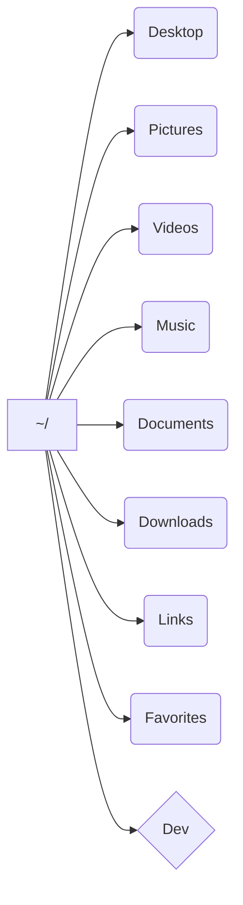

# Organizing Files and Folders as a Developer




***

## Appendix: Links

- [[Development]]
- [[CLI Tools List]]
- [[Command Line]]


*Backlinks:*

```dataview
list from [[Organizing Files and Folders as a Developer]] AND -"Changelog"
```