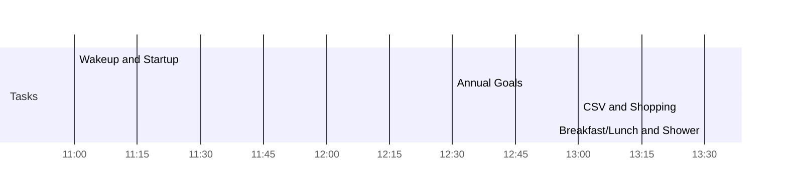

<< [[2022-01-07]] | [[2022-01-09]] >>

# Saturday January 08, 2022

## Day Planner


- [x] 11:00 Wakeup and Startup
- [x] 12:30 Annual Goals
- [x] 13:00 CSV and Shopping
- [x] 13:30 Breakfast/Lunch and Shower

## Agendas

- [ ] 

## Work

- 

## Tasks

- [ ]

## Todoist

![[Todoist-Embed]]

***

*Backlinks:*

```dataview
list from [[2022-01-08]] AND -"Changelog"
```