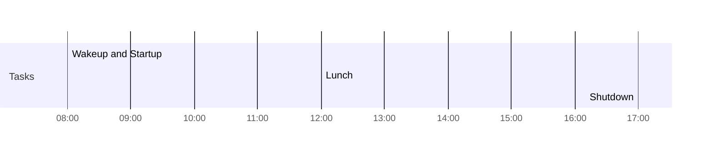

<< [[2022-08-17]] | [[2022-08-19]] >>

# Thu - 2022-08-18

## Day Planner


- [x] 08:00 Wakeup and Startup
- [x] 12:00 Lunch
- [x] 17:00 Shutdown


## Agendas

- [ ] 

## Notes


***

## Appendix: Links

- [[2-Areas/Daily-Notes/_README|Daily Notes]]

*Backlinks:*

```dataview
list from [[2022-08-18]] AND -"Changelog"
```