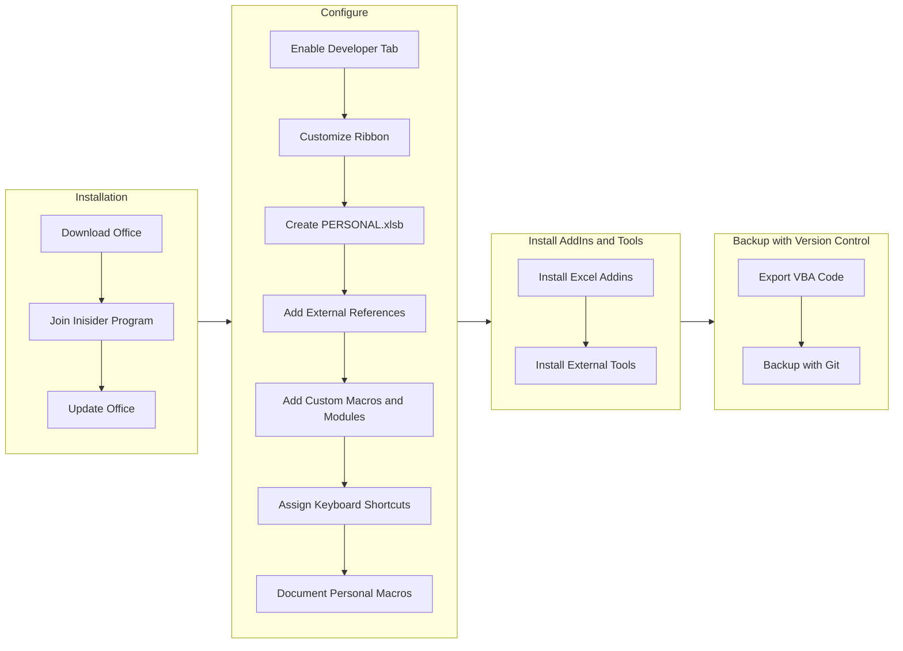

# Excel Developer Setup Guide

## Overview

To setup a proper development environment for [[Excel]] the following steps should be taken:

1. Download and Install [[Microsoft Office]] 

### Flowchart

***

## Appendix: Links and References

- [[2022-09-04]]
- [[2-Areas/Code/Excel/_README|Excel]]
- [[2-Areas/Code/VBA/_README|VBA]]

***

Jimmy Briggs <jimmy.briggs@jimbrig.com> | 2022

