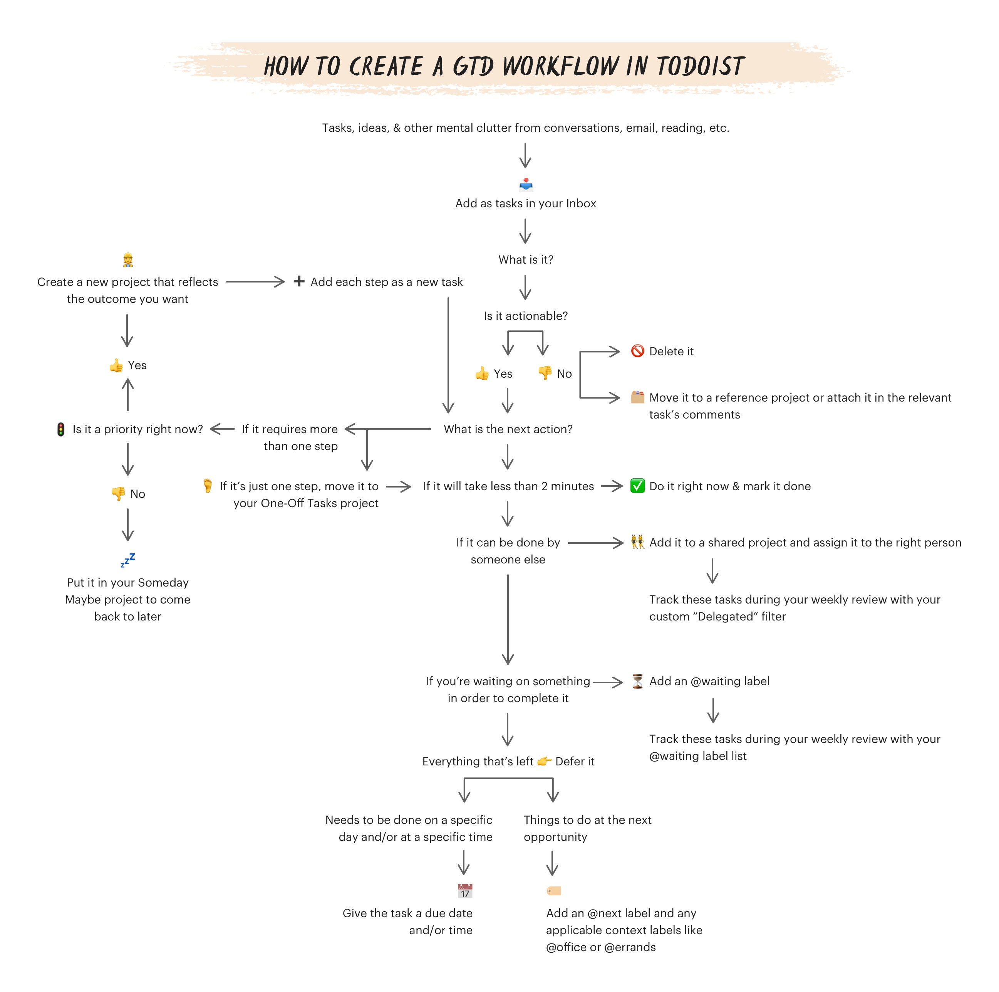

# Mindsweeps

## Flow Chart



* Refer to the *Mind_Sweep_Trigger_List.pdf* for determining what's on my mind.

## Incompletion Trigger List


## See Also

[Getting Things Done](../../0-Slipbox/Getting%20Things%20Done.md)
[GTD Mindsweep](../../0-Slipbox/GTD%20Mindsweep.md)
[GTD Setup List](../Lists/Ten%20Step%20GTD%20Setup%20List.md)
*GTD Weekly Review*
*GTD-WildSuccess-MindSweep.pdf*
*3-Resources/Highlights/Readwise 1/Articles/GTD Refresh, Part 5 Building the Weekly Review Habit*

*Contents*

````dataview
list from "2-Areas/Mindsweeps" AND !#Type/Readme
````

---

*Backlinks*

````dataview
list from [[_README]] AND -"Changelog"
````
