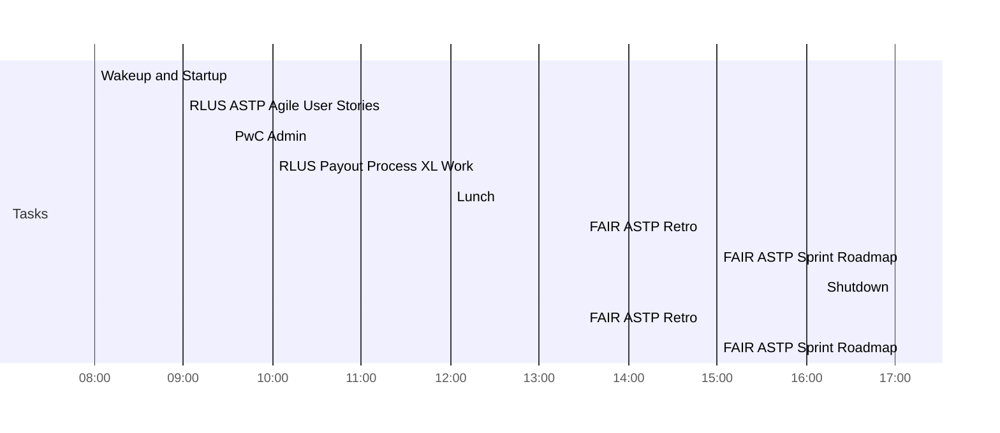

<< [[2022-06-01]] | [[2022-06-03]] >>

# Thursday June 02, 2022

## Day Planner


- [x] 08:00 Wakeup and Startup
- [x] 09:00 RLUS ASTP Agile User Stories
- [x] 09:30 PwC Admin
	- [ ]  Process Emails to Inbox Zero
	- [ ]  Review TalentLink Schedule
- [ ] 10:00 RLUS Payout Process XL Work
- [ ] 12:00 Lunch
- [ ] 13:30 FAIR ASTP Retro
- [ ] 15:00 FAIR ASTP Sprint Roadmap
- [ ] 17:00 Shutdown


## Agendas

- [ ] 13:30 FAIR ASTP Retro
- [ ] 15:00 FAIR ASTP Sprint Roadmap

## Work

- [[RLUS Payout Process]]
- [[RLUS FAIR ASTP]] User Stories


## Tasks

## Todoist

![[Todoist-Embed]]

***

*Backlinks:*

```dataview
list from [[2022-06-02]] AND -"Changelog"
```