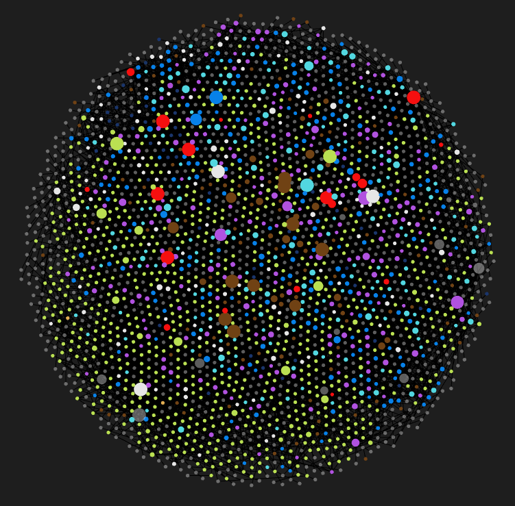

<head>
<link rel="apple-touch-icon" sizes="76x76" href="/apple-touch-icon.png?v=2.0">
<link rel="icon" type="image/png" sizes="32x32" href="/favicon-32x32.png?v=2.0">
<link rel="icon" type="image/png" sizes="16x16" href="/favicon-16x16.png?v=2.0">
<link rel="manifest" href="/site.webmanifest?v=2.0">
<link rel="mask-icon" href="/safari-pinned-tab.svg?v=2.0" color="#5bbad5">
<link rel="shortcut icon" href="/favicon.ico?v=2.0">
<meta name="apple-mobile-web-app-title" content="KaaS">
<meta name="application-name" content="KaaS">
<meta name="msapplication-TileColor" content="#2b5797">
<meta name="theme-color" content="#ffffff">
</head>
<h1 align="center">KaaS - Knowledge as a Service</h1>

    <a href="https://publish.obsidian.md/kaas-published/">KaaS - Obsidian Publish</a> | 
    <a href="https://kaas.jimbrig.com">KaaS - GitHub Pages</a> | 
    <a href="https://github.com/jimbrig/kaas">GitHub Repo</a>

<h4 align="center">Curated Knowledge for the Masses</h4>
<h5 align="center">Created by <a href="https://github.com/jimbrig">Jimmy Briggs</a></h5>

    

 

    <a href="https://github.com/jimbrig/KaaS/actions/workflows/convert-links.yml">
        </img>
    </a>
    <a href="https://github.com/jimbrig/KaaS/actions/workflows/mkdocs.yml">
        </img>
    </a>
    <a href="https://github.com/jimbrig/KaaS/actions/workflows/pages/pages-build-deployment">
        </img>
    </a>

    

## Welcome

Welcome to my personal knowledge base - **KaaS** or Knowledge as a Service.

Inside is my personal, customized, digital knowledge note-base structured loosely as a *[Zettelkasten](0-Slipbox/Zettelkasten.md)*, a collection of interlinked *[Atomic Notes](0-Slipbox/Atomic%20Notes.md)* about anything that interests me.

Consider this my *Digital Garden*. It is a garden that needs to be maintained and cared for overtime to produce fruitful outcomes.

## Contents

* [Welcome](README.md#welcome)
* [Roadmap](README.md#roadmap)
* [About](README.md#about)
  * [Publishing Setup](README.md#publishing-setup)
  * [Structure: Maps of Content](README.md#structure-maps-of-content)
* [Content](README.md#content)
  * [Code Snippets](README.md#code-snippets)
  * [Lists](README.md#lists)
  * [Tools](README.md#tools)

## Roadmap

Currently I am persistently perusing and curating my 10,000+ various notes houses across various platforms and locations: I would say I am about **18%** complete in this endeavor.

## About

Check out the `Meta/` Folder for details about this Vault and its setup:

* *Meta*
  * [About](2-Areas/Meta/About.md)
  * [Publish Workflow](2-Areas/Meta/Publish%20Workflow.md) *(MkDocs version only, not Obsidian Publish)*
  * [How I Take Notes](2-Areas/Meta/How%20I%20Take%20Notes.md)
  * [Vault Setup](2-Areas/Meta/Vault%20Setup.md)
  * [Structure](2-Areas/Meta/Structure.md)

The [Changelog](Changelog.md) is also a good *Meta* resource.

*Launch this vault directly via the **Obsidian URI Schema**: `obsidian://open?vault=KaaS`.*

### Publishing Setup

* This repository has three main branches: [main], [develop], and [gh-pages]. 
  * The [main] branch is a representation of the [develop] branch, but with all obsidian wiki-links converted to GitHub markdown links for display on GitHub as well as `_README.md` files converted to `README.md` for display on GitHub. 
  * The [develop] branch mirrors what I actually work with while inside the Obsidian application and gets sync'd automatically.
  * The [gh-pages] branch is deployed using [MkDocs]() and [GitHub Actions]().
  * Links are converted using the rust library [Obsidian-Export].
  * Links for deployment are converted using the [mkdocs-roamlinks]() plugin.

*Check out the various [GitHub Actions] utilized to enable this entire process.*

### Structure: Maps of Content

If this vault serves as my version of [a second brain](0-Slipbox/Building%20a%20Second%20Brain.md), then *Maps of Content* or *MOC's* are the underlying [synapse](3-Resources/Dictionary/Synapse.md)'s connecting the neurotransmitters of the brain together to form a complex, structured system.

In other words MOC's serve as structural, index notes that list related [Atomic Notes](0-Slipbox/Atomic%20Notes.md) in a single location.

Utilize *Maps of Content* (MOCs) to navigate the vault efficiently: 

Some Maps of Content to consider are:

* [Actuarial Science](2-Areas/MOCs/Actuarial%20Science.md)
* [Development](2-Areas/MOCs/Development.md)
  * [Data Science](2-Areas/MOCs/Data%20Science.md)
  * [Data Engineering](2-Areas/MOCs/Data%20Engineering.md)
  * [Databases](2-Areas/MOCs/Databases.md)
  * [Web Development](2-Areas/MOCs/Web%20Development.md)
  * [Software Development](2-Areas/MOCs/Software%20Development.md)
  * [R](2-Areas/Code/R/R.md) 
  * [R Shiny](2-Areas/MOCs/R%20Shiny.md)
  * [Python](2-Areas/Code/Python/Python.md)
  * [PowerShell](2-Areas/Code/PowerShell/PowerShell.md)
* [Productivity](2-Areas/MOCs/Productivity.md)
* [Personal Knowledge Management](2-Areas/MOCs/Personal%20Knowledge%20Management.md)
* [Mathematics and Statistics](2-Areas/MOCs/Mathematics%20and%20Statistics.md)
* [Finance](2-Areas/MOCs/Finance.md)

The others are still works in progress as I collect and curate more notes into the vault.

## Content

The vault has a variety of content including, but not limited to:

* Code Snippets
* Lists of Resources
* Checklists
* Slipbox Atomic Notes
* Guides and How-To's
* Lessons Learned
* Daily Notes
* Templates 
* Best Practices
* Documentation
* Tools by Category
* Mindsweeps 
* Goals and Learning Notes
* Project Support Notes
* Notes about People and Agendas
* Definitions
* Embedded Websites
* Kanban Boards
* MindMaps
* Highlights from a variety of sources
* Clippings from the Web
* Podcast Notes

And More!

### Code Snippets

See the *Code* folder's README for details on all of the code snippets included inside this vault. 

Currently I have code snippets for the following categories:

* *PowerShell* (Core)

* *Python*

* *R*

* *SQL Code*
  
  * *SQL - General*
  * *PostgreSQL SQL Code Snippets* 
  * *SQL Server*
  * *BigQuery*
* *Windows*
  
  * *Miscellaneous*
  * *Batch*
  * *Windows Command Line*
  * *Run*
  * *Registry*
  * *VBA*
  * *Windows PowerShell*

Plus:

* *Bash*
* *CSS*
* *GitHub Actions*
* *Javascript Code*
* *Pandoc*

### Lists

Under *2-Areas/Lists* I have curated lists for various topics you may find helpful:

*Lists*:

* [Actuarial Development Master Resource List](2-Areas/Lists/Actuarial%20Development%20Master%20Resource%20List.md)
* [Advanced Programming Concepts List](2-Areas/Lists/Advanced%20Programming%20Concepts%20List.md)
* [AWS Components Master List](2-Areas/Lists/AWS%20Components%20Master%20List.md)
* [Command Line Tools List](2-Areas/Lists/CLI%20Tools%20List.md)
* [Data Engineering Master List of Resources](2-Areas/Lists/Data%20Engineering%20Master%20List%20of%20Resources.md)
* [Database GUIs List](2-Areas/Lists/Database%20GUIs%20List.md)
* [Database Modeling Tools](2-Areas/Lists/Database%20Modeling%20Tools.md)
* [Excel Automation Resources](2-Areas/Lists/Excel%20Automation%20Resources.md)
* [Learn to Code Platforms Master List](2-Areas/Lists/Learn%20to%20Code%20Platforms%20Master%20List.md)
* [REST API Resources List](2-Areas/Lists/REST%20API%20Resources%20List.md)
* [Learn to Code Platforms Master List](2-Areas/Lists/Learn%20to%20Code%20Platforms%20Master%20List.md)
* [List of Python Flask Resources](2-Areas/Lists/List%20of%20Python%20Flask%20Resources.md)
* [Obsidian Plugins List](2-Areas/Lists/Obsidian%20Plugins%20List.md)
* [Online Developer Tools List](2-Areas/Lists/Online%20Developer%20Tools%20List.md)
* [Awesome R Package Development List](2-Areas/Lists/Awesome%20R%20Package%20Development%20List.md)
* [Productivity Apps List](2-Areas/Lists/Productivity%20Apps%20List.md)
* [R - Database Packages List](2-Areas/Lists/R%20-%20Database%20Packages%20List.md)
* [Online Developer Tools List](2-Areas/Lists/Online%20Developer%20Tools%20List.md)
* [Ten Step GTD Setup List](2-Areas/Lists/Ten%20Step%20GTD%20Setup%20List.md)
* [SQL Server List of Tools and Scripts](2-Areas/Lists/SQL%20Server%20List%20of%20Tools%20and%20Scripts.md)
* [R Shiny Packages List](2-Areas/Lists/R%20Shiny%20Packages%20List.md)
* [R Package Development Resources List](2-Areas/Lists/R%20Package%20Development%20Resources%20List.md)
* [R on the Web - List of Links](2-Areas/Lists/R%20on%20the%20Web%20-%20List%20of%20Links.md)

### Tools

See *Tools* for a vast listing of useful tools I've come across split into categories:

* *Developer Tools*
  * *Cloud Services*
    * *AWS*
    * *Azure*
    * *GCP*
  * *Command Line Utilities*
  * *Data Stack*
    * *Business Intelligence*
    * *Database GUI*
    * *Databases*
    * *Procedural Languages*
    * *Miscellaneous*
  * *Docker*
  * *Documentation*
    * *Static Site Generators*
    * *Text Editors*
    * *Utility*
  * *IDE*
  * *Languages*
    * *JavaScript*
    * *PowerShell*
    * *Python*
    * *R*
  * *Linux*
  * *Package Managers*
  * *Shell*
  * *Terminal*
  * *Version Control*
  * *Websites and Online Tools*

And many others!

---

---

[main]: https://github.com/jimbrig/KaaS-New/tree/main
[develop]: https://github.com/jimbrig/KaaS-New/tree/develop
[gh-pages]: https://github.com/jimbrig/KaaS-New/tree/gh-pages
[Obsidian-Export]: https://github.com/zoni/obsidian-export
[GitHub Actions]: https://github.com/jimbrig/KaaS-New/tree/main/.github/workflows
